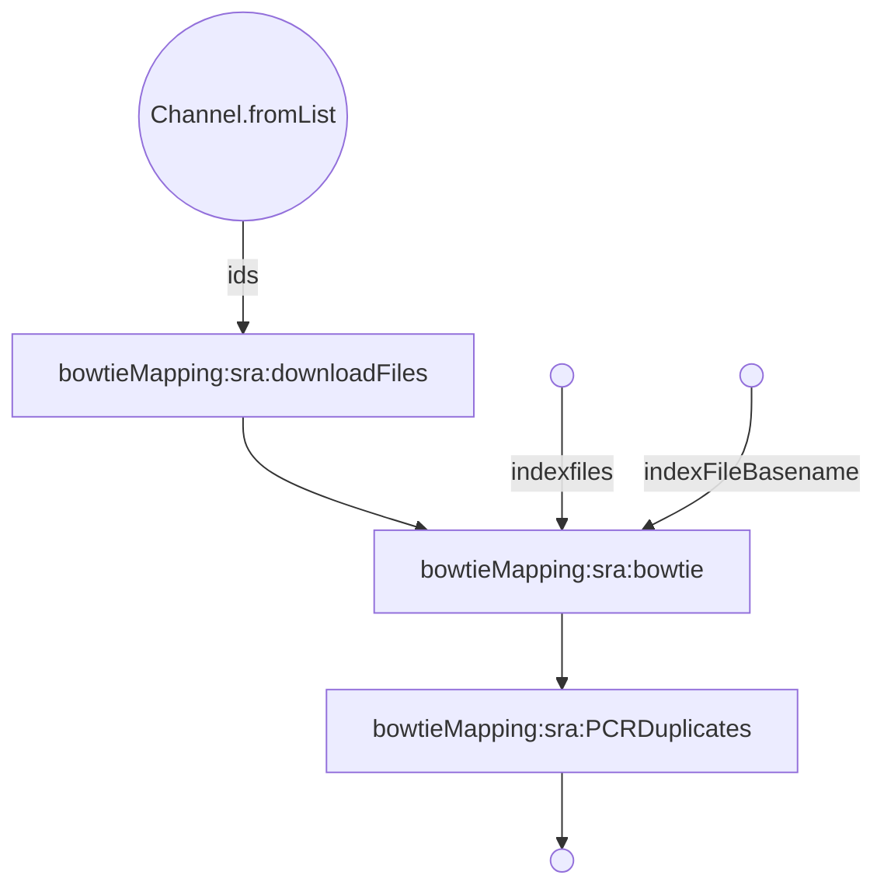
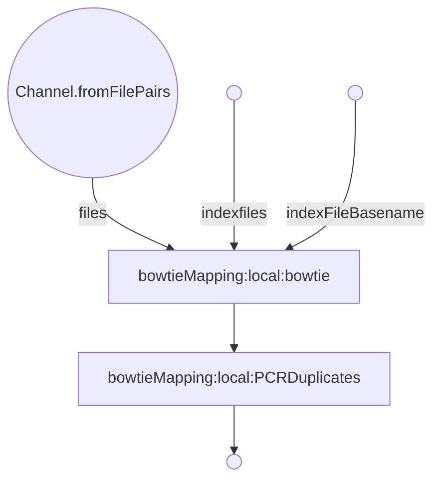

# bowtieMapping

***
bowtieMapping (From sra download)
***  

***
bowtieMapping (from local files)
***  

### Get Started
  * Install Nextflow
    
    `curl https://get.nextflow.io | bash`
  
  * Run the script
    
    `nextflow run VEuPathDB/blastSimilarity -with-trace -c  <config_file> -r main`
